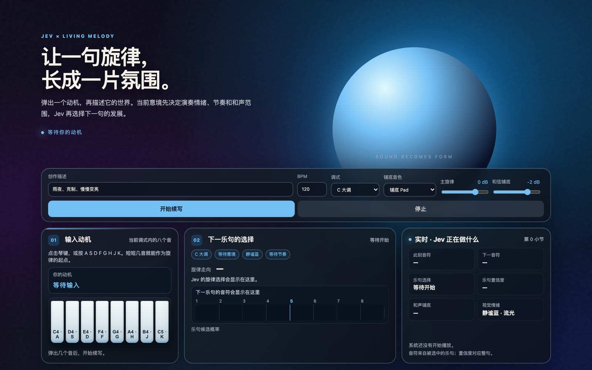
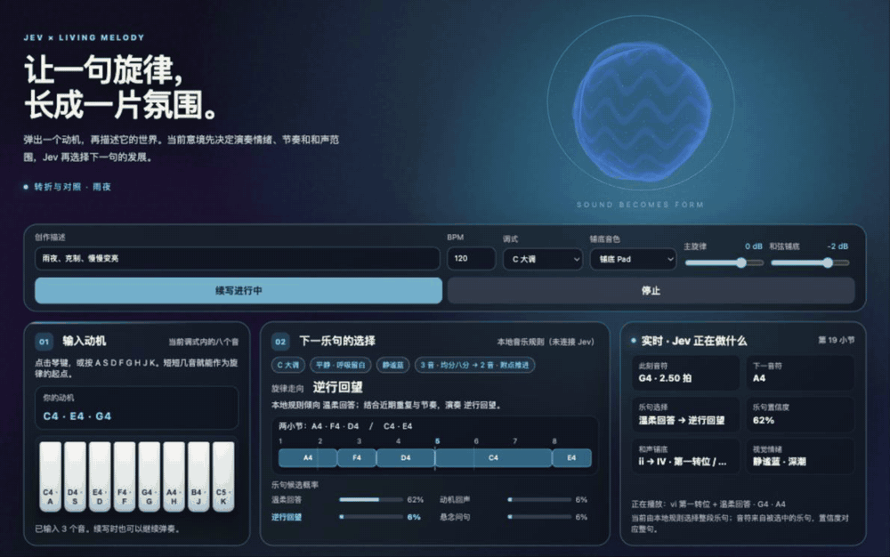
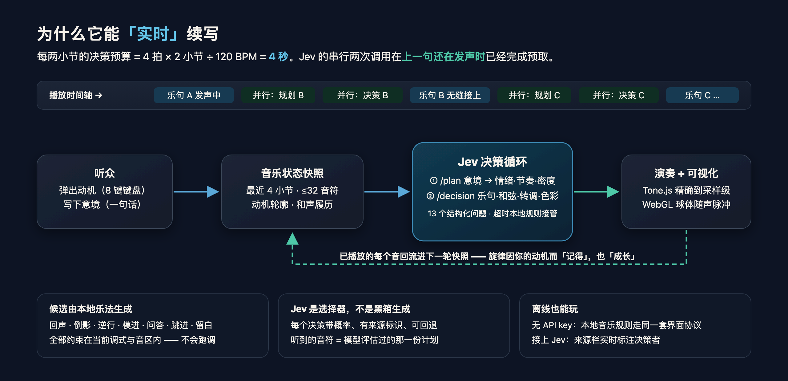

<div align="center">



# Jev · Living Melody

**让一句旋律，长成一片氛围。**

用极快的结构化决策实时续写音乐 —— 你弹几个音、写一句话，
Jev 每两小节听懂当前意境，在旋律、和声与色彩的岔路口替音乐选出下一步。

*A browser prototype where fast structured decisions power real-time music continuation.*

[快速开始](#-快速开始) · [它为什么能实时](#-它为什么能实时) · [决策协议](#-决策协议jev-是怎么做选择的) · [架构](#-架构) · [开发](#-开发)

</div>

---

## ✨ 它是什么

一段未完成的旋律，加上一个氛围描述——比如 **「雨夜、克制、慢慢变亮」**。

按下播放，音乐不会停下等你：每两小节，Jev 会读入当前音乐状态（你的动机、最近四小节、和声履历），判断意境推进到了哪一幕，然后**在上一句还在发声时**就选好下一句的旋律走向、和弦色彩、节奏密度，甚至画面该换成什么颜色。屏幕中央的 WebGL 球体不是装饰——它就是这条音乐此刻的声音形态：随每个音符脉冲，随每次决策换色。

这不是「输入 prompt → 等待 30 秒 → 得到一首完整的歌」。生成式音乐让你等待结果；Jev 让你**看着音乐在你面前实时生长**，每一次选择都有概率、有来源、可解释。决策速度就是产品本身。

| | 传统音乐生成模型 | Jev · Living Melody |
| --- | --- | --- |
| 响应方式 | 离线整曲生成 | **每 2 小节一次实时决策** |
| 等待时间 | 数十秒起 | **0 秒——决策藏在发声的间隙里** |
| 可控性 | 结果黑箱 | 每个乐句带意图、概率与回退链 |
| 交互 | 一次性 prompt | 中途随时补弹动机，音乐记得你 |

## 🎬 30 秒看懂

<table><tr>
<td width="62%">

**你在做什么**
1. 🎹 在调内八键上弹出动机（或按 `A S D F G H J K`）
2. 🖋️ 写一句意境，支持「平静 → 开心」式的分段叙事
3. ▶️ 点「开始续写」，之后的一切交给 Jev

**你会看到什么**
- 🌐 球体随音符脉冲、随情绪换色——决策被听见的同时被看见
- 🧭 决策卡实时摊开：选了哪句、为什么、概率多少、和弦怎么走
- 🔁 每隔 2 小节一次无缝衔接，120 BPM 下约 4 秒一个决策周期

</td>
<td width="38%">



</td>
</tr></table>

> 🎧 建议开启声音浏览。无声 GIF 无法传达一切，完整版见 [`docs/demo.mp4`](docs/demo.mp4)。

## ⚡ 它为什么能实时

核心思想只有一句话：**决策足够快、足够小，就能塞进音乐节拍的间隙。**

一次决策需要判断的不是「下一个音是什么」，而是一组**已经可播放的候选**里哪一句最符合故事——这让 Jev 成为选择器而非逐音符生成器，把推理规模压到了毫秒-秒级，而本地乐法引擎保证了每个候选都合法、在调内、不重复。

```
|◄────── 乐句 A 正在发声：4 拍 × 2 小节 ÷ 120 BPM = 4 秒 ──────►|
        └─ 在这 4 秒内并行完成 ─┘
           /plan（意境→情绪·节奏） + /decision（乐句·和弦·色彩）
                                                        └─► 乐句 B 无缝接上
```

三重保障让「实时」不建立在运气上：

- **压缩状态**：每轮请求只带最近 4 小节、≤32 个音符事件 + 动机轮廓，上下文小而稳定；
- **提前预取**：当前乐句第一小节响起时就开始规划下下句，两次串行调用拥有一个完整小节的窗口;
- **优雅降级**：1.75 秒超时即由本地音乐规则接管——界面明确标注决策来源，音乐永不中断。



## 🧭 决策协议：Jev 是怎么做选择的

每轮 `/decision` 向 Jev 提出 13 个结构化问题，覆盖音乐与视觉的同一瞬间：

| 问题 | 类型 | 决定什么 |
| --- | --- | --- |
| `phrase` | Choice | 从情绪档案允许的旋律候选中选出两小节乐句 |
| `harmony` / `harmony_next` | Choice | 两小节各自的和弦功能与色彩（triad / add9 / seventh） |
| `voicing` / `voicing_next` | Choice | 原位、转位或开放式配音 |
| `density` | Score | 下一小节的音符密度 |
| `key_shift` | Choice | 是否转向关系/同主音/五度邻近调（在四小节边界执行） |
| `motif_keep` | Noul | 用户动机是否应被清楚保留 |
| `visual_*`（5 项） | Choice/Score | 球体的色相、形变、运动、亮度与场景 |

旋律候选由 `melody.js` 从**你的动机**中抽取音程生成——回声、倒影、逆行、模进、问答、跳进、留白——全部约束在当前调式与音区内。Jev 选择后，前端保存**被评估的那一份原始播放计划**到小节边界直接演奏：你听到的，就是它权衡过的。

## 🚀 快速开始

```bash
git clone <repo-url> && cd living-melody
python3 server.py
# 打开 http://127.0.0.1:8787，点「开始续写」
```

零依赖：只需 Python 3，音频合成与三维可视化全部在浏览器内完成（Tone.js + Three.js 由 CDN 加载）。

**接上 Jev（可选）**

```bash
TYPESAFE_API_KEY=你的密钥 python3 server.py
```

没有密钥也完全可玩：服务端会以明确标识的「本地音乐规则」走同一套决策协议，界面上能看到决策来源的变化——这本身就是产品叙事的一部分。密钥只在本地 Python 进程中使用，从不发送给浏览器。

## 🏗 架构

```
浏览器（无构建步骤）                        本地服务端                Jev API
├─ app.js       状态快照 · 播放调度 · UI    ├─ /plan      意境→场景规划   结构化
├─ melody.js    动机变形 → 旋律候选池       ├─ /decision  乐句·和弦·色彩   决策
├─ harmony.js   调内和弦候选 · 声部连接     └─ 超时/无密钥 → 本地音乐规则
├─ direction.js 场景硬约束 · 情绪档案
├─ tonality.js  四小节边界的转调执行
└─ orb.js       Three.js 双层 GLSL 球体 · 粒子 · 光晕
```

- `server.py` 是薄代理：组装紧凑上下文、调 Jev、失败降级，全部决策带 `source` 标注；
- 意境分段（`平静→开心`）由 `narrativeStage()` 随小节推进切片——当前画面只约束当前情绪，后续场景不提前泄漏；
- 球体的色相/形变/亮度在 WebGL 帧循环里以不同速率插值，新决策到达时不会「跳帧」，只会像天色一样转过去。

## 🧪 开发

```bash
# 回归测试（旋律采样 / 和声 / 意境规划）
node --experimental-default-type=module tests/melody.test.mjs
node --experimental-default-type=module tests/harmony.test.mjs
node --experimental-default-type=module tests/direction.test.mjs

# 离线采样对比：重复率、候选利用率、强拍和弦对齐率
node --experimental-default-type=module tools/sample.mjs "雨夜，克制，慢慢变亮" 40
```

设计细节：[决策设计](JEV_DECISION_DESIGN.md) · [节奏导演](RHYTHM_DIRECTOR.md) · [采样报告](MELODY_SAMPLING_REPORT.md) · [术语表](CONTEXT.md)

## 🛠 技术选型

| 组件 | 选择 | 为什么 |
| --- | --- | --- |
| 音频引擎 | [Tone.js](https://github.com/Tonejs/Tone.js) | 浏览器音频时钟精度高，多声部调度成熟 |
| 可视化 | [Three.js](https://github.com/mrdoob/three.js) + 自写 GLSL | 双层形变球壳、粒子、光晕随音频特征实时响应 |
| 服务端 | Python 标准库 | 零 pip 依赖，一条命令起 |
| 候选生成 | 自研 `melody.js` / `harmony.js` | 动机变形乐法 + 调内和声声部连接 |

选型调研（含 OpenArranger、Contrapunk、RockDice、ACCompanion、AccoMontage2 的对比结论）见 [README 附录：选型调研](#appendix)。

## 🗺 路线图

- [ ] MIDI 键盘输入动机（参考 Contrapunk 的实时桥接）
- [ ] 铺底从「和弦」扩展为 drums / bass / pad 四层 groove，仍由 Jev 在小节边界选择
- [ ] 专门作曲模型生成更长原创主题候选，Jev 保持实时选择器角色
- [ ] 多听众同厅：一个人的动机，所有人的氛围

## 📜 License

Prototype for demonstration. 引入的开源组件各自遵循其上游许可证（Tone.js / Three.js 均为 MIT）。

---

<a id="appendix"></a>

<details>
<summary><b>附录：选型调研记录</b></summary>

| 项目 | 调研发现 | 是否作为原型基础 |
| --- | --- | --- |
| [Tone.js](https://github.com/Tonejs/Tone.js) | 浏览器音频时钟、合成器和多音调度成熟，MIT | 是，负责精确出声 |
| [Tonal](https://github.com/tonaljs/tonal) | JavaScript 调式、和弦与音程工具 | 后续接入；首版用固定标度减少依赖 |
| [OpenArranger](https://github.com/realsigmamusic/openarranger) | 浏览器自动伴奏，节奏分段按小节量化切换，MIT | 第二阶段「伴奏自由切换」的结构参考 |
| [Contrapunk](https://github.com/contrapunk-audio/contrapunk) | 实时 MIDI 和声/编配，含浏览器/桌面/DAW，MIT | 未来 MIDI 键盘阶段参考 |
| [RockDice](https://github.com/surikov/rockdice) | 约 200 个可转调 riff，drums/bass/lead/pad 四层，GPL-3.0 | 验证「有限伴奏候选」思路，不复用 GPL 代码 |
| [ACCompanion](https://github.com/CPJKU/accompanion) | 严谨的实时跟谱伴奏研究系统 | 不适合自由即兴的网页 MVP |
| [AccoMontage2](https://github.com/billyblu2000/AccoMontage2) | 离线全曲和声/编配，依赖 PyTorch | 适合离线整曲，不适合每小节实时选择 |

结论是手动抽取：保留 OpenArranger 的量化切换理念，采用 Tone.js 的浏览器音频时钟，并在两者之间放入 Jev 的有限候选决策——既能实时，也保留每一次选择的概率、回退和可解释性。

</details>
