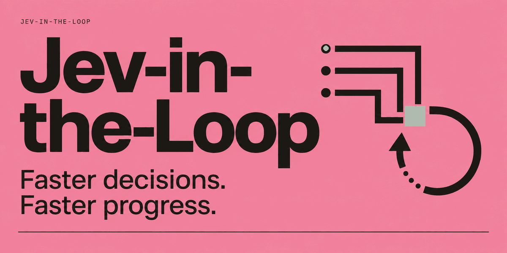
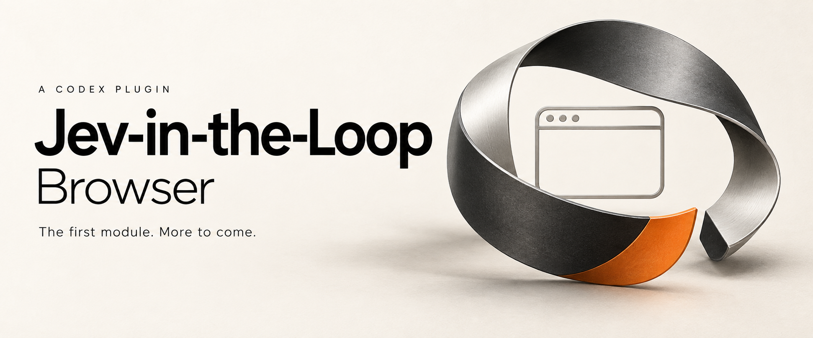
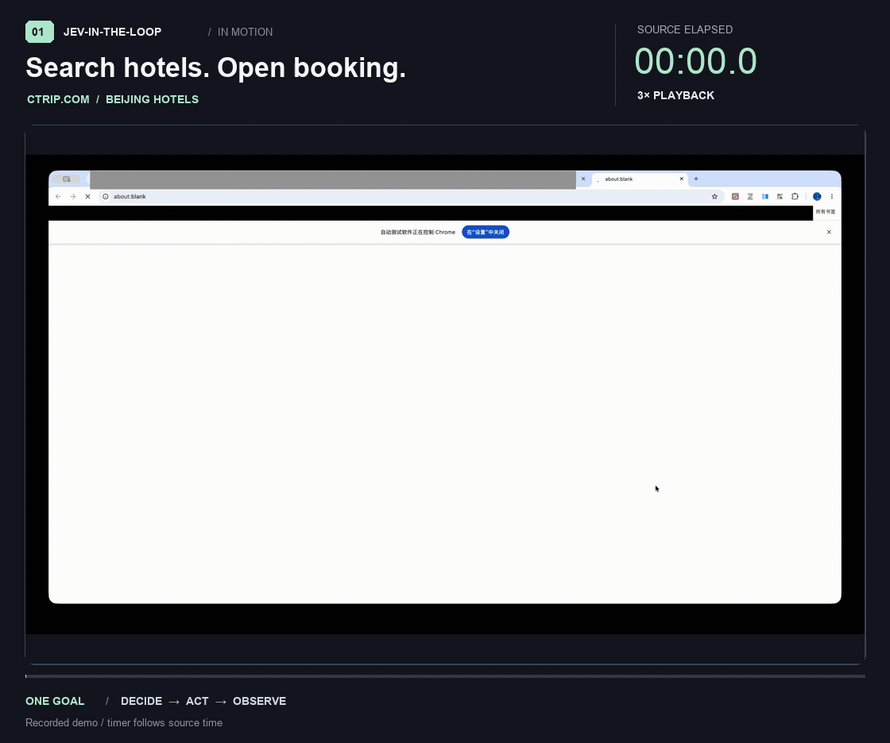
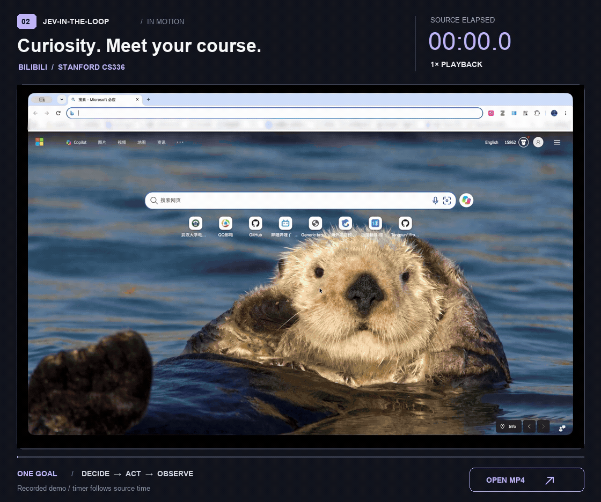

# Jev-in-the-Loop

**English** · [简体中文](README_ZH.md)



### Faster decisions. Faster progress.

**Jev-in-the-Loop explores how Jev can accelerate tasks that rely on LLM decision-making.** From choosing the next action to moving a workflow forward, we bring Jev into the decision loop to help agents turn intent into results faster.

**Which decisions can Jev take on to make the whole task faster?** Each module explores a different answer. Browser is the first; more modules will grow from the tasks and decision loops we explore next.

[Browser module](#jev-in-the-loop-browser) · [Project direction](#project-direction) · [Contribute](https://github.com/Tongyun1/Jev-in-the-Loop/blob/main/CONTRIBUTING.md)

## Jev-in-the-Loop: Browser

<p align="center">
  
</p>

**A Codex plugin for ultrafast browser interaction.** Browser is the first module of Jev-in-the-Loop. Install it in Codex and describe your task: Codex understands the goal and prepares the inputs, Jev quickly selects the next action, and the plugin executes it in local Chrome. Searches, clicks, typing, and navigation flow from one step to the next.

**Your Codex. Jev's speed. One workflow.** Keep the assistant that understands your task, and give its browser work a fast decision loop. Your existing Codex setup plus a TypeSafe API key is all the model setup you need—no additional text-generation service.

[Watch the demos](#browser-demos) · [Get started](#get-started) · [Installation guide](plugins/jev-browser-plugin/README.md#install-in-codex)

### Browser demos

#### One prompt. Ready to book.

> Find hotels in Beijing, for two adults, checking in November 11, 2026, and out November 12.
> Choose a room and open the booking form. Leave the final confirmation to me.

Change the destination, search hotels, explore the details, and select a room. A sequence of clicks becomes one continuous flow, stopping at the booking form for you to take over.



[Watch the Beijing hotel demo (MP4)](https://github.com/user-attachments/assets/50a78ed3-9fbb-4434-a969-86b6bebd6e88) · **3× playback** · Timer shows recording elapsed time.

#### From curiosity to a course

> Search Bilibili in English for Stanford CS336 and open the first video.

Enter the query, submit the search, and open the course. From something you want to learn to the video in front of you.



[Watch the original MP4](https://github.com/user-attachments/assets/0a7e59a4-65af-4f65-9d15-17ac95641864) · **1× playback** · Timer shows recording elapsed time.

No need to spell out every click. Say what you want to accomplish, and let the actions follow.

### ⚡ Fewer clicks for you. More getting done.

**Codex brings the context. Jev brings the pace.**

Codex turns your request into a plan and prepares the words to type. Jev chooses the next action, its target, and the prepared input in one TypeSafe request. Put the assistant you already use and a fast decision model to work together, with no separate text-model API key.

**An upgrade to the workflow you already use.**

Install as a Codex plugin, describe the outcome in your conversation, and watch it unfold in local Chrome. Browser work becomes part of your existing task—from the first instruction to the page you take over.

**One request. A whole sequence in motion.**

Search, select, type, and navigate through multiple stages within a single plugin call. The loop reads the current page, checks progress, and carries the task forward. Paused sessions can resume with their stage and tab progress intact.

**The handoff is part of the task.**

Ask for the result you actually want: a course open and ready to watch, a form ready for review, or a page ready to explore. Set the destination and the stopping point together, so the workflow ends where your next move begins.

### 💬 Give it a task

Find something to learn:

```text
Use Jev to search Bilibili in English for Stanford CS336 and open the first video.
```

Prepare a trip:

```text
Use Jev to find hotels in Beijing on Ctrip for November 11–12, 2026, one room, two adults.
Open a hotel, choose a room, and stop at the booking form. Do not submit an order.
```

Start with a browser task you find yourself doing by hand.

### Get started

Install the **Browser plugin in Codex**. You'll need **Codex, Chrome**, and a **TypeSafe API key**. **uv** manages the local runtime, including Python and the plugin's dependencies.

```sh
git clone https://github.com/Tongyun1/Jev-in-the-Loop.git
cd Jev-in-the-Loop/plugins/jev-browser-plugin
```

Follow the [installation guide](plugins/jev-browser-plugin/README.md#install-in-codex) to configure your key, connect Chrome, and install the plugin. Then open a new Codex task and say: **“Use Jev to…”**

<a id="project-direction"></a>

## 🔬 More decisions. More possibilities.

The browser is our first application, not the boundary of the project. We want to explore other LLM-driven decisions, such as tool selection and workflow branching, and study where Jev can help existing agents.

Start with real tasks. Test speed and task completion through reproducible experiments. Turn what works into usable modules.

Have a task you'd like it to take on? [Tell us](https://github.com/Tongyun1/Jev-in-the-Loop/issues). Interested in the direction? **Star the repo** and follow what comes next.

---

[Development guide](https://github.com/Tongyun1/Jev-in-the-Loop/blob/main/CONTRIBUTING.md) · [Security & privacy](https://github.com/Tongyun1/Jev-in-the-Loop/blob/main/SECURITY.md) · [MIT License](https://github.com/Tongyun1/Jev-in-the-Loop/blob/main/LICENSE)

The Browser module builds on [browser-use/jev-ultrafast](https://github.com/browser-use/jev-ultrafast), with thanks to the upstream project. See [third-party notices](https://github.com/Tongyun1/Jev-in-the-Loop/blob/main/THIRD_PARTY_NOTICES.md).
